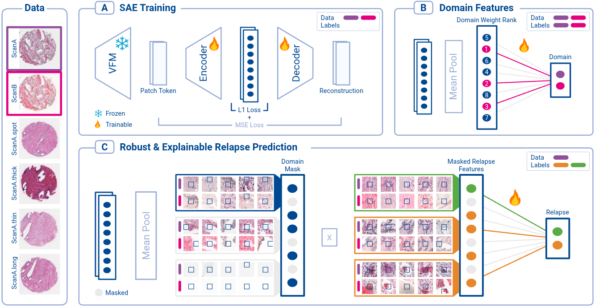

# EXPOSE: Explainable and Domain-Robust Embeddings from Pathology Vision Foundation Models using Sparse Autoencoders

[](https://eccv.ecva.net/)
[](https://excv-workshop.github.io/)

**EXPOSE** is a framework for learning explainable and domain-robust representations from pathology vision foundation model (VFM) embeddings using sparse autoencoders (SAEs).

Accepted at the [eXCV Workshop](https://excv-workshop.github.io/) of [ECCV 2026](https://eccv.ecva.net/).



---

## Overview

EXPOSE consists of three main stages:

1. **Sparse Autoencoder (SAE) training:**
   Learn sparse features from pathology VFM embeddings.

2. **Domain-specific feature identification:**
   Train a domain classifier and identify SAE features associated with domain-specific information.

3. **Domain-robust classifier training:**
   Train the downstream relapse classifier while masking the top-$k$ domain-specific SAE features.

The resulting representations aim to preserve task-relevant information while reducing sensitivity to domain-specific variation.

---

## Environment

Create the conda environment:

```bash
conda create --name expose python=3.11
conda activate expose
```

Install the required Python packages:

```bash
pip install -r requirements.txt
```

---

## Data

EXPOSE operates on embeddings extracted from a pathology vision foundation model (VFM).

The code requires:

1. Precomputed VFM embeddings
2. A metadata CSV containing domain and downstream task information

### VFM Embeddings

We use **H0-mini** ([Hugging Face Link](https://huggingface.co/bioptimus/H0-mini)) to extract embeddings from TMA spot images.

The embeddings should have a shape of:

```text
n_patches × embedding_dim
```

and each image patch features should be stored as a separate HDF5 file in ```data/embeddings/``` like this:

```python
import h5py
embedding_path = "data/embeddings/..."
with h5py.File(embedding_path, 'w') as file:
   file.create_dataset("patch_features", data = patch_features)
```

For example:

```text
data/
├── embeddings/
│   ├── sample_001.h5
│   ├── sample_002.h5
│   └── ...
└── metadata.csv
```

Each embedding file should contain the VFM embeddings corresponding to the respective sample/image.

### Metadata

A metadata CSV is required at:

```text
data/metadata.csv
```

The metadata must contain information for each sample/image, including at least the following columns:

| Column           | Description                                     |
| ---------------- | ----------------------------------------------- |
| `sample_id`      | Unique sample/image identifier                  |
| `domain`         | Domain, site, or cohort identifier              |
| `domain_label`   | Domain/site/cohort label                        |
| `relapse_label`  | Downstream relapse task label                   |
| `embedding_path` | Path to the corresponding embedding file        |
| `split`          | Dataset split (e.g., `train`, `val`, or `test`) |

The identifiers and paths specified in `metadata.csv` must correspond to the available embedding files. In particular, every `embedding_path` must point to an existing embedding, and each embedding should be associated with the appropriate `sample_id`.


### Example

A metadata file may look like:

```csv
sample_id,domain,domain_label,relapse_label,embedding_path,split
0,domain1,0,0,sample_0.h5,train
1,domain1,0,0,sample_0.h5,val
2,domain2,1,1,sample_1.h5,train
3,domain2,1,1,sample_1.h5,val

```

---

## Directory Structure

After setup, the repository should have a structure similar to:

```text
EXPOSE/
├── data/
│   ├── embeddings/
│   │   ├── ...
│   └── metadata.csv
│
├── scripts/
│   ├── 01_run_train_sae.sh
│   ├── 02_run_train_domain_classifier.sh
│   ├── 03_run_define_domain_features.sh
│   └── 04_run_train_relapse_classifier.sh
│
├── src/
│
├── requirements.txt
└── ... (other files)
```

---

## EXPOSE Training

### 1. Sparse Autoencoder Training

First, train a sparse autoencoder (SAE) on the VFM embeddings.

Run:

```bash
bash scripts/01_run_train_sae.sh
```

The SAE learns a sparse representation of the original VFM embeddings.

The resulting SAE features are used in the subsequent domain analysis and downstream classification steps.

---

### 2. Domain-Specific Feature Identification

The second stage identifies SAE features that encode domain-specific information.

#### 2.1 Train the Domain Classifier

Train a classifier to predict the domain from the SAE representation:

```bash
bash scripts/02_run_train_domain_classifier.sh
```

The classifier is used to determine which SAE features contain information predictive of the domain.

#### 2.2 Define Domain-Specific Features

Obtain linear weights from domain classifier to identify domain-specific SAE features:

```bash
bash scripts/03_run_define_domain_features.sh
```

---

### 3. Relapse Classifier Training

Finally, train the downstream relapse classifier while masking the identified domain-specific SAE features:

```bash
bash scripts/04_run_train_relapse_classifier.sh
```

This allows the downstream classifier to operate on an SAE representation with the selected domain-specific features removed.

---

## References

### Primary Implementation Reference
- **cytosae** ([dynamical-inference/cytosae](https://github.com/dynamical-inference/cytosae)): 
  The SAE architecture and loss function implementation are adapted from this repository.

### Vision Foundation Models
- **Bioptimus H0-mini** ([huggingface.co/bioptimus/H0-mini](https://huggingface.co/bioptimus/H0-mini)): 
  Used for extracting embeddings from tissue microarray (TMA) spots
  
---
## License

This project is released under the **MIT License**.

See [LICENSE](LICENSE) for the full license text.
